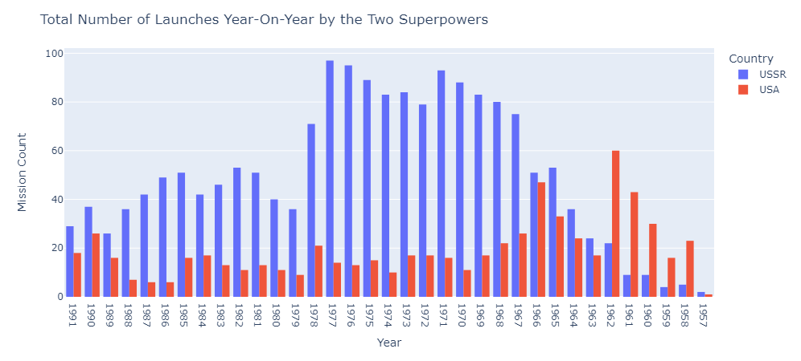
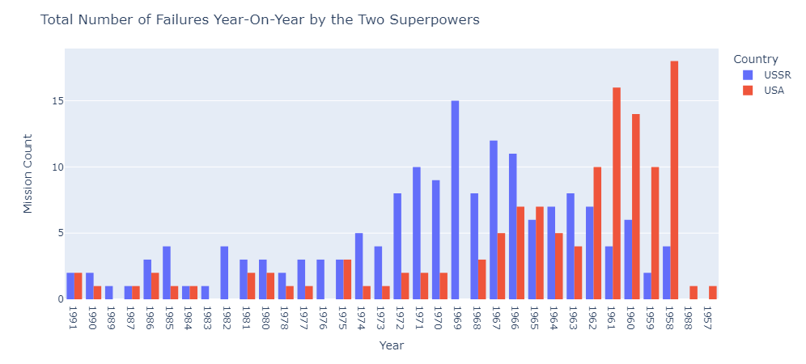

# Portfolio-Ciencia-de-Dados

# Bem-vindo ao meu portfólio de ciência de dados!

  

Olá! Meu nome é Artur Dias e eu sou um estudante de 24 anos cursando Bacharelado em Engenharia de Computação. Minha paixão está em machine learning, ciência de dados, estatística e matemática, e estou constantemente trabalhando em projetos nessas áreas. Explore-os abaixo!

## Projetos

##  PROBLEMA DE CLASSIFICAÇÃO

### [**Casos de violência domestica contra a mulher**](https://github.com/aarturdias/estudo-de-caso-de-violencia-domestica-contra-mulher)
- **Descrição:** Este repositório contém uma Análise Exploratória de Dados (EDA) focada em compreender os padrões, tendências e características da violência doméstica contra a mulher.
- **Objetivos:** Descobrir qual algoritmo de aprendizagem possa prever com maior eficiência as chances de uma mulher sofrer agressão, com base em certas váriaveis.
- **Resultados:** Após realizar a análise exploratória e o pré-processamento dos dados, implementamos um modelo de Regressão Logística para prever a ocorrência de violência doméstica contra a mulher com base nas variáveis disponíveis no conjunto de dados. O desempenho do modelo foi avaliado utilizando a métrica de acurácia.

**Acurácia: 75,18%**

- [Clique aqui para conferir o projeto completo](https://github.com/aarturdias/estudo-de-caso-de-violencia-domestica-contra-mulher)

- Alguns resultados obtidos;

# ACURÁCIA DOS MODELOS
- Regressão Logística 75.18%
- Random Forest 74.39%
- XGBoost 73.79%
- LGBM 73.18%
- KNN 72.93%
- SVC 72.60%
- Árvore de decisão 67.17%
- Navie Bayes 53.89%

## EDA

### [Análise Exploratória de Dados (EDA) sobre a Corrida Espacial e Lançamentos de Foguetes](https://github.com/aarturdias/Analysis-the-Space-Race)
- **Descrição:** Este repositório contém uma Análise Exploratória de Dados (EDA) sobre a corrida espacial e lançamentos de foguetes. A análise tem como objetivo explorar os dados históricos de lançamentos espaciais, identificar padrões e tendências ao longo do tempo
- **Objetivos:** 
  Explorar a distribuição dos lançamentos espaciais por ano, país e agência espacial.
  Identificar tendências e padrões ao longo das décadas.
  Analisar o sucesso e falhas dos lançamentos de foguetes.
  Investigar as características dos foguetes e suas missões.
  Gerar visualizações que facilitem a interpretação dos dados históricos da corrida espacial.
- **Resultados:** A Análise Exploratória de Dados (EDA) sobre a corrida espacial e lançamentos de foguetes revelou padrões interessantes e insights valiosos. Observamos uma intensa atividade de lançamentos durante os anos 1960 e 1970, impulsionada pela competição entre os Estados Unidos e a União Soviética, que culminou com o pouso do homem na Lua em 1969. Ao longo das décadas, a análise destacou a diversificação dos países e agências espaciais envolvidas em lançamentos, com um aumento significativo nas missões comerciais e privadas nas últimas duas décadas.

- [Clique aqui para conferir o projeto completo](https://github.com/aarturdias/Analysis-the-Space-Race)

- Alguns resultados obtidos;

- Número total de lançamentos ano após ano de USSR x USA

  

- Números de Falhas nos lançamentos

  

## EM DESENVOLVIMENTO
- Estudando sobre Deep learning e Visão Computacional

## CONTATO
* [LinkedIn](https://www.linkedin.com/in/artur-dias-gama/)
* [GitHub](https://github.com/aarturdias)
* E-mail - aartur.dias@hotmail.com
